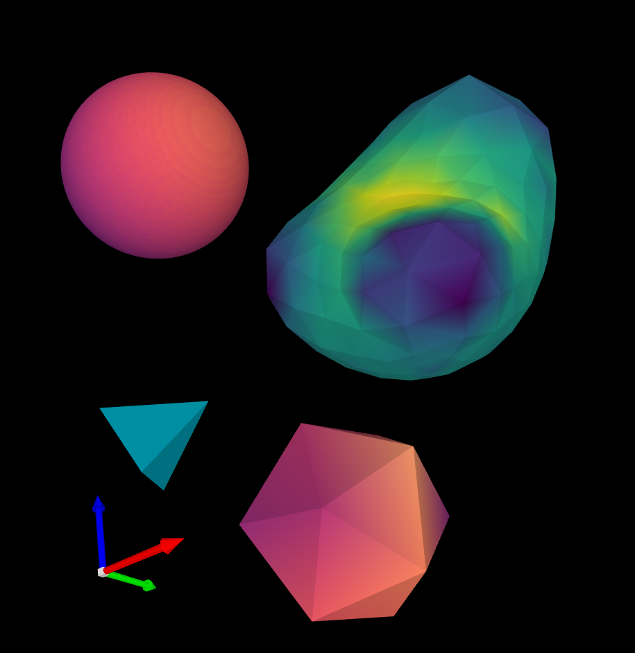

## Viewer for triangular mesh .ply files
__A small project to learn c++__



This repository contains three modules: a .ply file parser,
a mesh analyze toolset, and a simple render library.

The goal was to implement a fast and simple meshviewer using shaders and c++.
All transformations are matrix-free and rely on quaternions to keep things simple and efficient.

__Features:__
- display multiples meshes
- flat shading/smooth shading
- colormaps
- zoom and rotate with the mouse
- show the current orientation
- orthographic/perspective projection
- curvature, normal, ordered one-ring, and ordered-adjacency computation


## Requirements
- Linux
- opengl 4.6
- glfw


## Compilation

        make -C sources

## Usage

        ./meshviewer meshes/deform.ply

__Code API example:__

```cpp
// Read a ply file and show the object and it's curvature
int main() {

  PlyFile file("meshes/deformHQ.ply");

  // Retrieving the vertices's normals from the file.
  std::vector<PropertyName> normal_property_names = {
      PropertyName::nx, PropertyName::ny, PropertyName::nz};

  std::vector<double> normals; // The data will be converted to double automatically
  file.get_subelement_data<double>("vertices", normal_property_names, normals);


  Mesh mesh(file.vertices, file.faces);

  // Computing the curvature to define the colors of the rendered object.
  std::vector<double> k;
  mesh.set_one_ring(); // the one ring is required to compute the curvature
  mesh.set_mean_curvature();

  mesh.scalar_mean_curvature(k);

  std::vector<double> colors;
  get_interpolated_colors(k, colors, INFERNO);

  MeshRender render(500, 500, mesh.vertices, mesh.faces, colors);

  // adding another mesh to the display
  PlyFile file2("meshes/spinningtop.ply");
  render.add_object(file2.vertices, file2.faces, ShaderProgramType::FLAT_FACES);

  render.render_loop(NULL, NULL);
  render.render_finalize();
  return 0;
}
```
