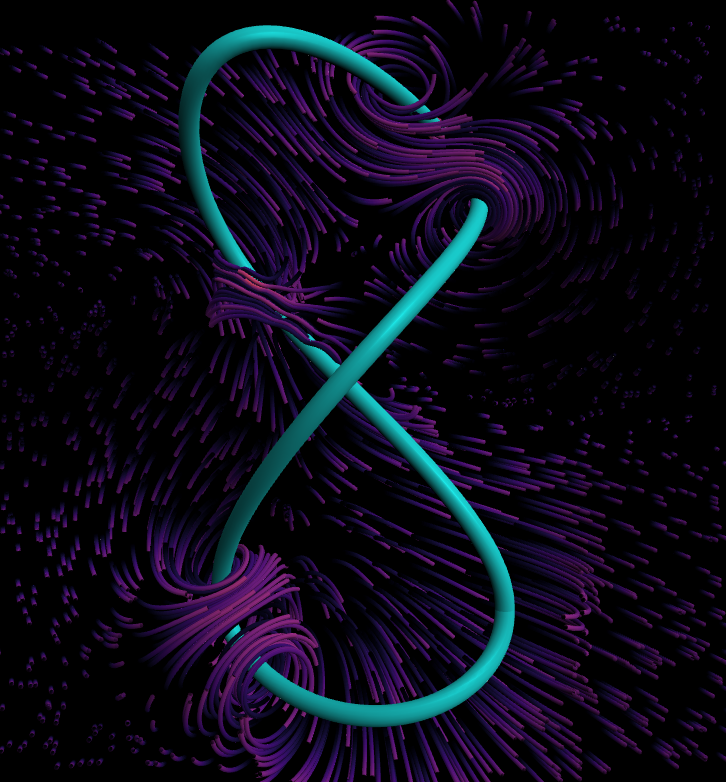

## Mesh library
__A small project to learn c++__

</img>
</img>

This repository contains three modules: a .ply file parser,
a mesh/graph operator toolset, and a simple render library.

The goal was to implement a fast and simple meshviewer using shaders and c++.
All transformations are matrix-free and rely on quaternions to keep things simple and efficient.

## Features:
__Render:__
- display multiples meshes
- flat shading + specular highlight
- colormaps
- zoom and rotate with the mouse
- show the current orientation
- perspective projection
- animation using a callback function
- plot 3d vector fields with large amount of vectors
- plot 3d curves using extrusion in geometry shader

__Mesh:__
- curvature, normal, ordered one-ring, and ordered-adjacency computation
- fast edge splitting algorithm, preserving data locality
- Primitives: torus, icosahedron, tetrahedron, cube

<figure>
    
    <figcaption> Creation of a sphere from an icosahedron. </figcaption>
</figure>
<figure>
    
    <figcaption> Tubular curve extruded in geometry shader. </figcaption>
</figure>


## Requirements
- Linux
- make
- opengl 4.6
- glfw

## Compilation
The command line executable can be compiled with,

        make -C src ../meshviewer

## Tests
The Mesh module has a specific test directory for unit testing.
The tests are run with make using Linux diff command and reference files.

## Usage
__CLI__

        ./meshviewer meshes/deform.ply

__Code API example:__

```cpp
// Reads a ply file and show the object and it's curvature
#include "mesh/mesh.hpp"
#include "ply/plyfile.hpp"
#include "render/colormap.hpp"
#include "render/trimesh_render.hpp"
#include <vector>

auto main() -> int {

  PlyFile file("meshes/deformHQ.ply");

  // Retrieving the vertice normals from the file.
  std::vector<PropertyName> normal_property_names = {
      PropertyName::nx, PropertyName::ny, PropertyName::nz};

  std::vector<double> normals;
  file.get_subelement_data<double>("vertices", normal_property_names, normals);


  Mesh mesh(file.vertices, file.faces);


  // Computing the curvature to define the colors of the rendered object.

  // get_mean_curvature takes one_ring as argument to make explicit that the
  // method depends on the one-ring.
  mesh.set_one_ring();
  std::vector<double> kn = mesh.get_mean_curvature(mesh.one_ring);
  std::vector<double> k = mesh.get_scalar_mean_curvature(kn);


  std::vector<double> colors = Colormap::get_interpolated_colors(k, Colormap::INFERNO);

  MeshRender render(500, 500, mesh.vertices, mesh.faces, colors);

  // adding another mesh to the display
  Mesh icosahedron = Primitives::icosahedron();
  render.add_object(icosahedron.vertices, icosahedron.faces);

  render.render_loop(nullptr, nullptr);
  render.render_finalize();
  return 0;
}
```
